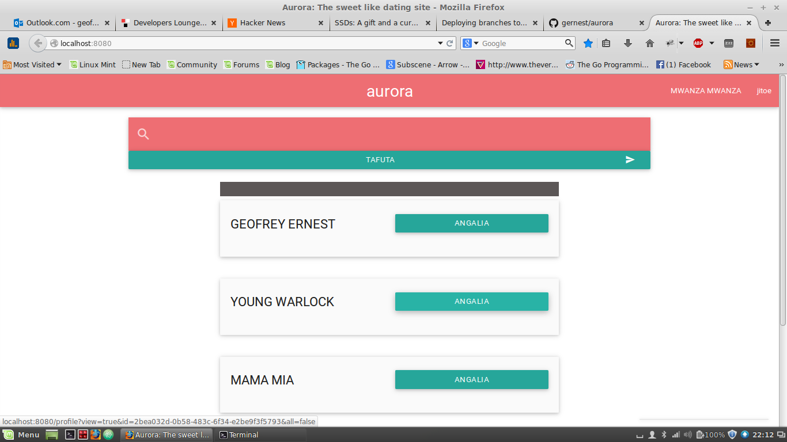
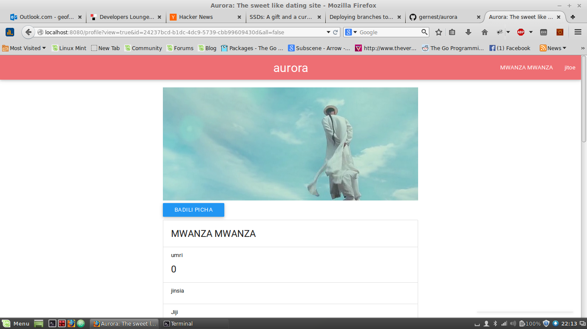

# aurora  

### What is aurora?
Aurora is a lightweight social network application written in [Go programming language](http://golang.org/),
and using [bolt database](https://github.com/boltdb/bolt) as its main storage source.

This is not for production use, I started this project as a way to learn more about the Go
programming language, and also to experiment with testing web services in Go.

## Guide
1. [Getting started](docs/getting-started.md)
	- [x] Overview
	- [x] Installation

### Alternative way to build
I was digging in the go standard library, and thought I should experiment on the `text/template`. I extended it and made a toy yet working build tool(a.k.a template based build tool). The source code is found here [zanzibar](https://github.com/gernest/zanzibar).

You can build aurora using zanzibar tool. Install it first.

	go get github.com/gernest/zanzibar

clone aurora

	git clone https://github.com/gernest/aurora

cd into aurora and run zanzibar

	cd aurora&&zanzibar

you should find your build in builds directory.

Roadmap
-------

## Features
- [x] chat
- [x] profile management
- [x] photo upload
- [x] ??? any ideas?

Scrrenshots
___________

## Contributing
This is a playground, all kinds of contibutions are welcome. Since it is for learning and
experimenting, feel free to think of new ideas.

The important thing is to test, whatever you add make sure it has tests. Also be clear on what
exactly ypur PR does.

## License

This project is under the MIT License. See the [LICENSE](https://github.com/gernest/aurora/blob/master/LICENCE) file for the full license text.
